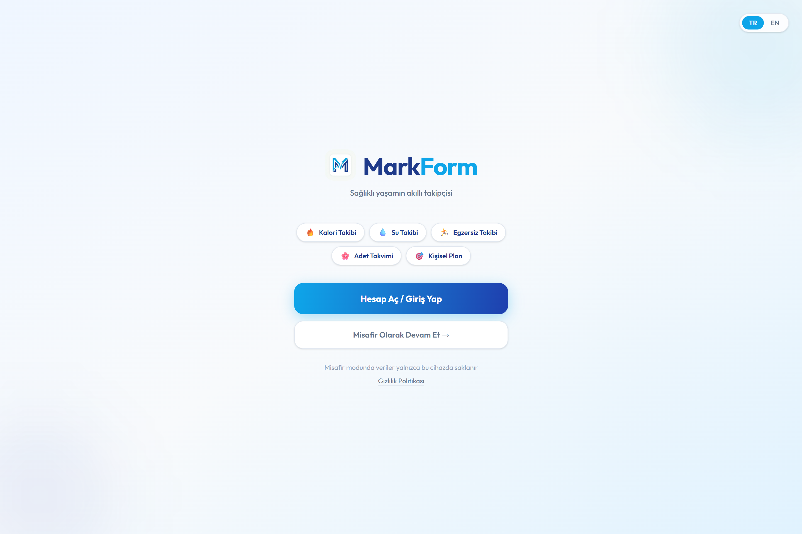
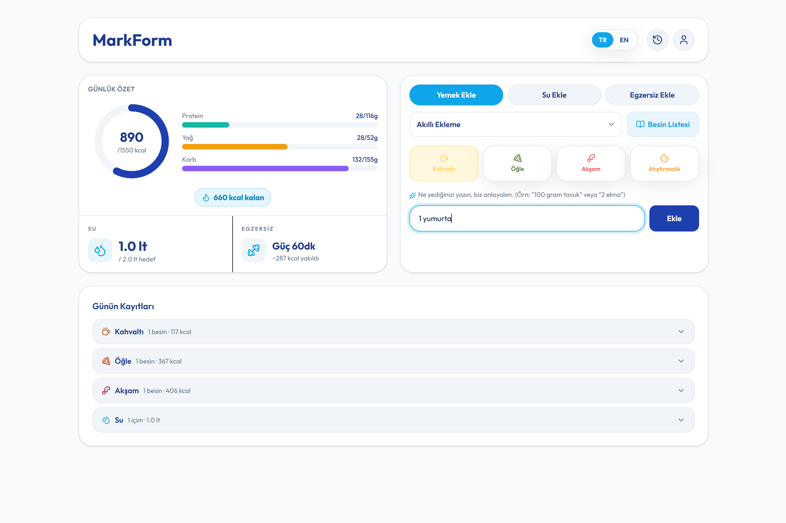
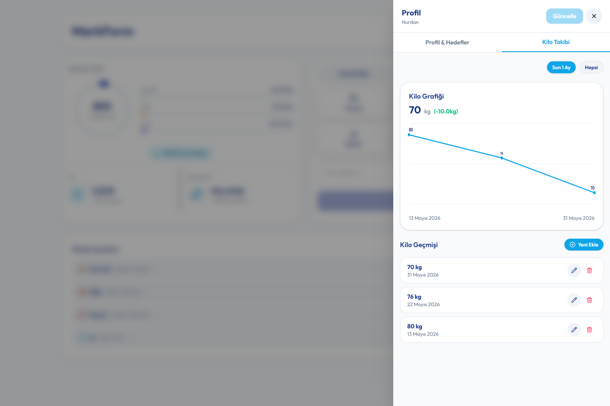
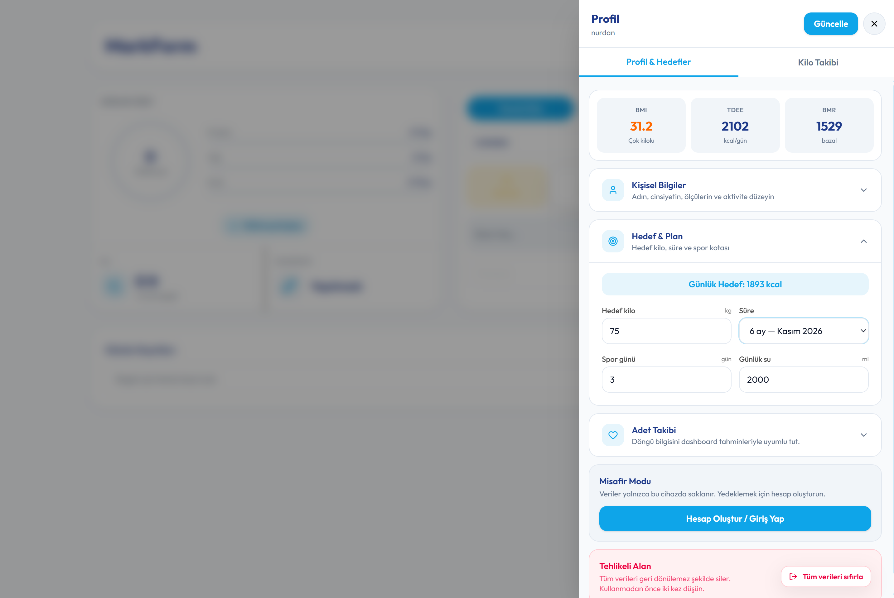
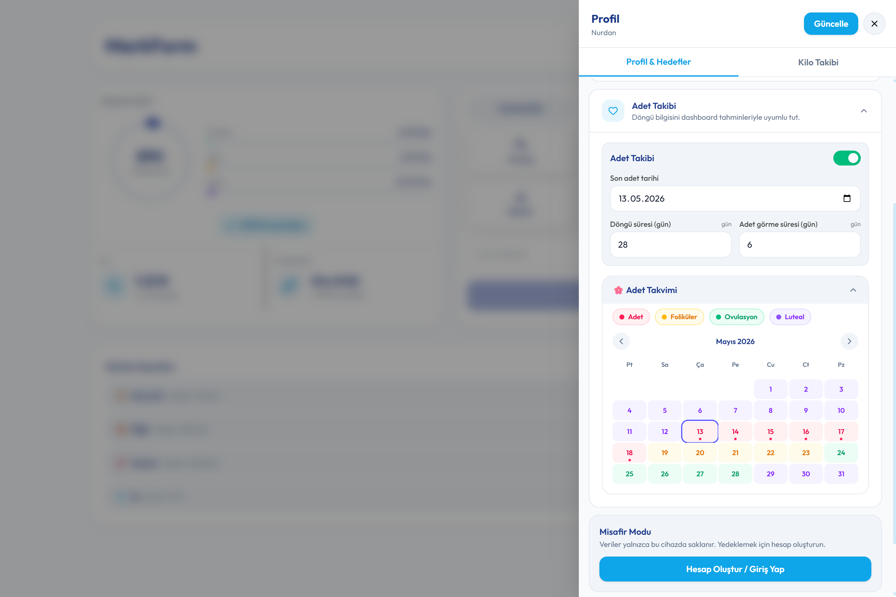

# MarkForm

MarkForm, kalori, su, egzersiz, kilo ve adet takibini tek bir panelde toplayan, hedef odaklı bir sağlık takip uygulamasıdır. Uygulama; onboarding akışı, günlük takip, akıllı besin ekleme, barkod tarama, kilo grafikleri, adet takvimi ve Supabase senkronizasyonu ile hem yerel hem bulut tabanlı bir deneyim sunar.

## Ekran Görüntüleri

**Giriş ve karşılama**



**Onboarding: kişisel plan ve hedef seçimi**


**Ana sayfa: günlük özet ve hızlı ekleme**



**Kilo takibi: grafik ve geçmiş**



**Profil: bilgiler, hedef ve güncelleme**



**Adet takvimi: döngü evreleri**



## Uygulama akışı

- Giriş / Kayıt / Misafir modu ile başlangıç.
- 3 adımlı onboarding ile temel bilgiler, metabolizma raporu ve hedef plan seçimi.
- Dashboard üzerinden günlük kalori, su, egzersiz ve öğün takibi.
- Profil panelinde hedef, kilo geçmişi, adet takvimi ve hesap ayarları.

## Özellikler (Tam Liste)

### Onboarding ve Hedef Planlama

- 3 adımlı onboarding: temel bilgiler, metabolizma raporu, hedef belirleme.
- BMR ve TDEE hesapları (Mifflin-St Jeor).
- İdeal kilo ve güvenli hedef süresi önerisi.
- Önerilen plan ile tek tık seçim veya manuel hedef oluşturma.
- Günlük kalori hedefi ve güvenli limit uyarıları.
- Aktivite düzeyi seçimi (hareketsiz -> aşırı aktif).
- Dil seçimi (TR/EN) onboarding ekranında da bulunur.

### Dashboard ve Günlük Takip

- Günlük özet kartı: kalori halkası, makro dağılımı (protein/karb/yağ) ve kalan kcal.
- Su takibi: günlük hedef ve anlık tüketim.
- Egzersiz durumu ve tahmini yakılan kalori.
- Günün kayıtları: öğün bazlı liste + su kayıtları.
- Su kayıtlarını düzenleme/silme.
- Sonraki 7 gün ve son 30 gün geçmiş görünümü.

### Besin Takibi ve Kütüphane

- Öğüne göre besin ekleme (kahvaltı, öğle, akşam, atıştırmalık).
- Dört farklı ekleme modu:
  - Listeden seçim (kütüphane).
  - Manuel giriş (kcal + makro).
  - Akıllı ekleme (metinden miktar + besin eşleştirme).
  - Barkod tarama (Open Food Facts).
- Barkod taramada fener kontrolü.
- Besin kütüphanesi: ekle, düzenle, sil.
- Başlangıç besin listesi CSV (besin-listesi.csv) ile gelir.

### Su Takibi

- Hazır su miktarları (100/200/400/500/1000 ml).
- Manuel su girişi.
- Günlük hedefe göre durum.

### Egzersiz Takibi

- Hazır egzersiz tipleri (yürüyüş, koşu, güç, bisiklet, kardiyo).
- Manuel egzersiz adı girişi.
- Süre bazlı kalori tahmini.

### Profil ve Sağlık Raporu

- Profil panelinde BMI, TDEE, BMR özetleri.
- Kişisel bilgi ve hedef güncelleme (kilo, boy, yaş, hedef kilo, hedef süre).
- Haftalık spor kotası ve günlük su hedefi.
- Kilo grafiği (son 30 gün / tüm zamanlar).
- Kilo geçmişi ekleme, düzenleme, silme.

### Adet Takibi

- Adet takvimi (adet, foliküler, ovulasyon, luteal).
- Son adet tarihi ve döngü uzunluğuna göre tahmin.
- Dashboard uyarısı: adet tarihi yaklaşırken bildirim.

### Kimlik, Misafir Modu ve Bulut Senkronizasyonu

- E-posta ile kayıt/giriş.
- Google ile giriş.
- Misafir modu (veriler sadece cihazda saklanır).
- Supabase senkronizasyonu (profil + günlük loglar).
- Yerel veriden buluta otomatik geçiş.

### Diğer

- Zustand ile localStorage persist.
- Toast bildirimleri.
- TR/EN dil desteği tüm temel ekranlarda.

## Teknoloji ve Altyapı

- React 19 + TypeScript + Vite
- Zustand (state + persist)
- Tailwind CSS
- Supabase (auth + data sync)
- html5-qrcode (barkod tarama)
- Open Food Facts API (barkod ürün verisi)

## Kurulum

```bash
npm install
npm run dev
```

## Ortam Değişkenleri

Supabase kullanımı için aşağıdaki değişkenler gereklidir:

```bash
VITE_SUPABASE_URL=...
VITE_SUPABASE_ANON_KEY=...
```

## Build ve Preview

```bash
npm run build
npm run preview
```

## Notlar

- Misafir modunda veriler yalnızca cihazda tutulur.
- Supabase tabloları: profiles, daily_logs.
- Barkod verisi Open Food Facts üzerinden çekilir.
